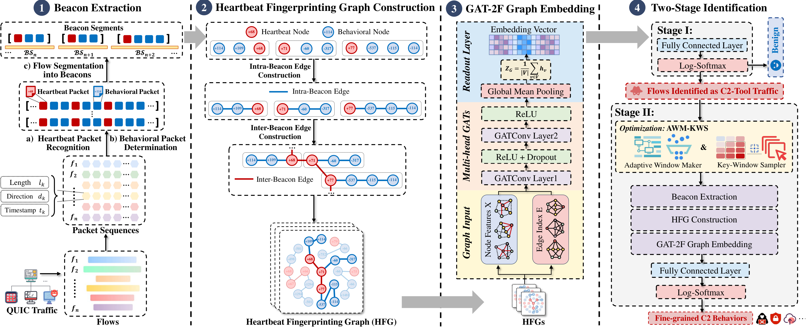

# HFG-QUEST: Heartbeat Fingerprinting Graph based Fine-grained Identification of Encrypted Spyware C2 Behavior Traffic over QUIC

This repository contains the source code and a cache-only reproducibility package for **HFG-QUEST**, a two-stage framework for **early** and **fine-grained** identification of QUIC-encrypted spyware Command-and-Control (C2) behavior traffic.

QUIC encrypts application data together with most transport metadata, which gives spyware C2 channels ideal cover and blinds traditional flow-statistics monitors. HFG-QUEST anchors identification on what stays invariant in C2 communication: the periodic, small, client-initiated *heartbeat* packets and the beacon structure they delimit. It treats heartbeats as semantic anchors, reorders the early packets into beacon segments, builds a Heartbeat Fingerprinting Graph (HFG) over their stable intra- and inter-beacon structure, encodes each HFG with a Graph Attention Network with Feature Fusion (GAT-2F), and classifies the embedding with a two-stage identifier.

## Overview

 

The pipeline consists of four main components:

1. **Beacon Extraction.** Recognizes heartbeat packets (HBs) from the early encrypted packet sequence using an adaptive multi-evidence HB-Score (size, rhythm, direction), treats the rest as behavioral packets (BPs), and segments the flow into heartbeat-delimited beacon segments (BSs).
2. **Heartbeat Fingerprinting Graph (HFG) Construction.** Builds a graph that captures intra-beacon packet transitions and inter-beacon heartbeat relations, aggregating the patterns that recur across beacons while suppressing transient per-packet noise.
3. **GAT-2F Graph Embedding.** Encodes each HFG into a embedding. Attention learns to down-weight anomalous nodes caused by packet loss, so the encoder concentrates on the stable, recurring C2 logic.
4. **Two-Stage Identification.** A coarse-to-fine identifier. **Stage I** screens the C2-tool family (benign / Merlin / DeimosC2 / Sliver) from a short early window. **Stage II** applies the Adaptive-Window Maker and Key-Window Sampler (**AWM-KWS**) strategy to retain behavior-bearing windows over a longer window, then identifies the fine-grained C2 behavior with a per-family behavior head.

## Repository Layout

```text
HFG-QUEST_demo/
├── README.md
├── source/
│   ├── GAT1.py
│   ├── GAT2.py
│   ├── v2_common.py
│   ├── v2_dataset.py
│   ├── v2_preprocess.py
│   ├── v2_robustness.py
│   ├── v2_run_experiment.py
│   ├── v2_stage1.py
│   └── v2_stage2.py
├── env/
│   └── env.yml
├── data/
│   ├── hb_cache/
│   │   ├── benign.txt
│   │   ├── deimos_*.txt
│   │   ├── merlin_*.txt
│   │   └── sliver_*.txt
│   └── awm_cache/
│       ├── benign_packets.txt
│       ├── deimos_*_packets.txt
│       ├── merlin_*_packets.txt
│       └── sliver_*_packets.txt
├── preprocessed/
│   └── v2/
│       ├── hb_cache/
│       │   └── 8491b3f8d3/
│       │       └── before_awm_kws/
│       └── awm_cache/
│           └── bb3f916ba9/
│               └── after_awm_kws/
├── config/
│   ├── cache_inventory.json
│   ├── config_resolved.json
│   ├── dataset_summary.json
│   ├── stage1/
│   │   ├── metrics.json
│   │   └── model_best.pth
│   └── stage2/
│       ├── metrics.json
│       ├── deimos_head/
│       │   ├── metrics.json
│       │   ├── model_best.pth
│       │   └── training_history.json
│       ├── merlin_head/
│       │   ├── metrics.json
│       │   ├── model_best.pth
│       │   └── training_history.json
│       └── sliver_head/
│           ├── metrics.json
│           ├── model_best.pth
│           └── training_history.json
└── runs/
    └── v2/
```

## Environment

We recommend `conda`. If your machine already has a working PyTorch / PyG / scapy / scikit-learn stack, you may reuse it directly.

1. Create and activate the environment

```bash
conda env create -f env/env.yml -n hfg_quest
conda activate hfg_quest
```

1. Verify the core dependencies

```bash
python - <<'PY'
import torch, sklearn, scapy, torch_geometric
print("torch:", torch.__version__)
print("cuda available:", torch.cuda.is_available())
print("sklearn ok")
print("scapy ok")
print("torch_geometric ok")
PY
```

## Running the Pipeline

> **Always run commands from the package root.** Relative paths to the cache resolve from there, so do not run `v2_run_experiment.py` from inside `source/`.

```bash
cd HFG-QUEST
```

### 1) Syntax / compile check (optional)

```bash
python -m py_compile \
  source/v2_preprocess.py \
  source/v2_common.py \
  source/v2_stage1.py \
  source/v2_stage2.py \
  source/v2_run_experiment.py \
  source/GAT1.py \
  source/GAT2.py
```

No output means the check passed.

### 2) Reproduce training and evaluation

```bash
python source/v2_run_experiment.py \
  --config config/config_resolved.json
```

A leading `+` marks packets selected by the heartbeat extraction stage in the before-AWM cache. New results are written to:

```text
runs/v2/YYYYMMDD_HHMMSS_<experiment_name>_<config_hash>/
```

### 3) Inspect the packaged results

A run summary is written per run:

```bash
cat runs/v2/<new_run_dir>/run_summary.json
```

## Troubleshooting

**The run cannot find the cache.** Confirm your working directory is the package root:

```bash
pwd
ls preprocessed config source runs
```

Please do not launch `v2_run_experiment.py` from inside `source/`, or relative paths will resolve incorrectly.

## Contact

If you have any questions regarding the dataset, implementation, or framework, please feel free to contact. The complete dataset is available upon reasonable request.

- Dikang Dai — `dikangdai@seu.edu.cn`

School of Cyber Science and Engineering, Southeast University, Nanjing, China.

